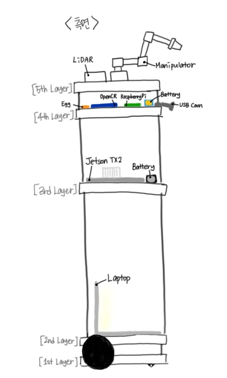

# Boogie_theGuider

## 개요
- 프로젝트명: Boogie The Guider
- 참여자: 강민지(wbclair7@konkuk.ac.kr), 권미경(kmk3942@konkuk.ac.kr) [2명]
- 프로젝트 일자: 2019년 12월 ~ 진행중
- 주제: Turtlebot3 Waffle과 Open Manipulator를 이용한 건물 안내로봇 제작

## 단계별 구현 목표
- 라이다 뒷부분에 오픈 매니퓰레이터를 부착함에 따라 장애물로 인식하게 되는데 이를 상쇄하고 정확한 맵 따기
- 각각의 맵을 저장하여 좌표로 지정하여 로봇을 제어하기
- 젯슨 보드에서 영상처리 구현하기
- 무선 라우터를 이용하여 젯슨 tx2 보드와 라즈베리 사이 통신 장애없이 값을 주고 받을 수 있도록 구현하기
- 전력 소모량을 계산하고 정확한 하드웨어 구성 완성하기
- 실시간으로 장애물을 회피하고 최적화된 루트로 갈 수 있는 알고리즘 완성하기
- 영상처리를 통하여 엘레베이터를 조작하도록 로봇 제어하기

 그 외에도 필요하다 생각되는 부분은 추후에 추가할 예정입니다.

## 로봇 구성 계획



```
    - 1층: 액추에이터(바퀴)
    - 2층: 클라이언트 역할을 위한 노트북 (층수를 전달 받을 예정, 코드 실행)
    - 3층: Jetson TX2, 배터리(3cell, 6000mah)
    - 4층: Pocket WIFI(무선라우터 대체), OpenCR, 배터리(3cell, 3700mah), USB camera
    - 5층: LiDAR, Open Manipulator
```
대략적인 구상으로 높이 80cm를 예상하고 있으며 부품이 추가되거나 구성이 변경될 수 있습니다.